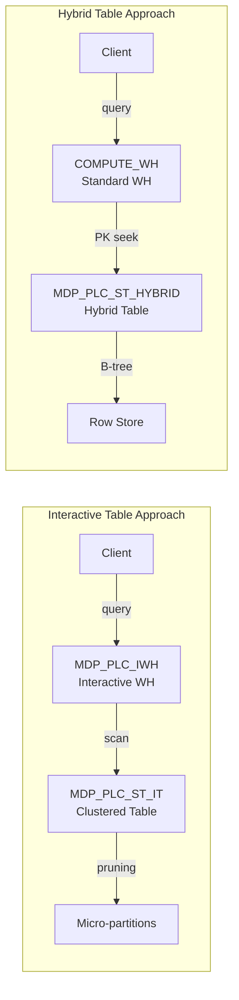

# Plan: MDP PLC Hybrid Table Benchmark

## Context

### Existing setup (interactive table approach)
- **Source**: `ISRG_D3_DB.CURATED.MDP_PLC_ST` (20M rows, 0.71 GB)
- **Interactive table**: `ISRG_D3_DB.CURATED.MDP_PLC_ST_IT` clustered on `CONSENSUS_UNIQUE_IDENTIFIER`
- **Interactive warehouse**: `MDP_PLC_IWH` (XSMALL, always-on, ~350 GB cache)
- **Workload**: Point lookups by `CONSENSUS_UNIQUE_IDENTIFIER` (NUMBER(19,0), 100% unique, zero NULLs)
- **Current perf**: p50 ~159-235ms client-side, 67ms server-side, up to 486 req/s

### Key findings from exploration
- PK column is `NUMBER(19,0)` with 20M distinct values, zero NULLs - ideal for hybrid table PK
- 10 VARIANT columns are allowed in hybrid tables (just can't be indexed)
- 1 TIMESTAMP_TZ column is allowed (just can't be in PK/UNIQUE/FK index)
- Table is 0.71 GB - well under the 2TB per-database hybrid storage limit
- Hybrid tables don't need clustering keys; data is ordered by PK natively
- Hybrid tables don't use result cache (`USE_CACHED_RESULT` is ignored)
- Hybrid table quota: ~16,000 ops/sec per database (80/20 read/write balanced)

### Why hybrid tables may beat interactive tables for this workload
- **B-tree index on PK**: Direct O(1) lookup by primary key vs micro-partition pruning
- **No dedicated warehouse**: Uses any standard warehouse (no always-on cost)
- **Sub-10ms point reads typical**: Hybrid table point lookups are designed for single-digit ms latency
- **Native OLTP optimization**: Row-store backed, not columnar scan

### Potential concerns
- **VARIANT column size**: Each row has 10 VARIANT columns (JSON arrays/objects). Hybrid tables store in row-store which may be less efficient for large semi-structured payloads than columnar storage.
- **2TB database limit**: Not an issue here (0.71 GB), but worth noting for future growth.
- **No result cache**: Every query hits the row store. For identical repeated lookups, interactive table + result cache may still win.
- **Load time**: CTAS into hybrid table with 20M rows may take longer than CTAS into a standard/interactive table.

## Implementation Steps

### Step 1: Create `sql/hybrid_setup.sql`

```sql
-- =============================================================================
-- MDP PLC Hybrid Table Setup
-- Point lookup optimization for CONSENSUS_UNIQUE_IDENTIFIER via B-tree PK
-- Target: sub-50ms point lookup latency (expected: sub-10ms warm)
-- =============================================================================

USE SCHEMA ISRG_D3_DB.CURATED;

-- Create Hybrid Table with explicit schema (required for CTAS)
-- Primary key on CONSENSUS_UNIQUE_IDENTIFIER provides B-tree index
CREATE OR REPLACE HYBRID TABLE ISRG_D3_DB.CURATED.MDP_PLC_ST_HYBRID (
  CONSENSUS_UNIQUE_IDENTIFIER NUMBER(19,0) NOT NULL PRIMARY KEY,
  ALL_OBSERVED_UIDS VARIANT,
  LOWER_TIER_IDS VARIANT,
  UPPER_TIER_IDS VARIANT,
  LOWER_SERIAL_NUMBERS VARIANT,
  UPPER_SERIAL_NUMBERS VARIANT,
  LOWER_SERIAL_NUMBERS_DETAIL VARIANT,
  UPPER_SERIAL_NUMBERS_DETAIL VARIANT,
  FINAL_LOWER_SERIAL_NUMBER VARCHAR(16777216),
  FINAL_UPPER_SERIAL_NUMBER VARCHAR(16777216),
  LOWER_PART_NUMBERS VARIANT,
  LOWER_PARTCLASS VARCHAR(16777216),
  UPPER_PART_NUMBERS VARIANT,
  UPPER_PARTCLASS VARCHAR(16777216),
  LOWER_WORK_ORDER_NUMBERS VARIANT,
  UPPER_WORK_ORDER_NUMBERS VARIANT,
  WORK_ORDERS_DETAIL VARIANT,
  SERIAL_UID_RESOLUTION VARIANT,
  LOWER_TIER_COUNT NUMBER(38,0),
  UPPER_TIER_COUNT NUMBER(38,0),
  CONSENSUS_CONFIDENCE FLOAT,
  LINK_TYPE VARCHAR(16777216),
  DEDUP_STATUS VARCHAR(16777216),
  LINKAGE_LAST_UPDATED TIMESTAMP_TZ(9)
)
AS SELECT * FROM ISRG_D3_DB.CURATED.MDP_PLC_ST;

-- Verify row count
SELECT COUNT(*) AS row_count FROM ISRG_D3_DB.CURATED.MDP_PLC_ST_HYBRID;

-- Test point lookups (uses any warehouse - no dedicated interactive WH needed)
SELECT * 
FROM ISRG_D3_DB.CURATED.MDP_PLC_ST_HYBRID
WHERE CONSENSUS_UNIQUE_IDENTIFIER = 8146597745;

SELECT * 
FROM ISRG_D3_DB.CURATED.MDP_PLC_ST_HYBRID
WHERE CONSENSUS_UNIQUE_IDENTIFIER = 9223371420611404425;
```

### Step 2: Create `tests/stress_test_hybrid.py`

Duplicate of the existing stress test with these changes:
- `TABLE = "ISRG_D3_DB.CURATED.MDP_PLC_ST_HYBRID"`
- `WAREHOUSE = "COMPUTE_WH"` (standard warehouse, no interactive WH needed)
- Update header/logging to identify as hybrid table test
- Same test tiers, same connection pool approach, same metrics

The key comparison is: can a hybrid table on a standard warehouse match or beat an interactive table on a dedicated interactive warehouse for PK point lookups?

### Step 3: Create `docs/hybrid_vs_interactive.md`

Document the benchmark comparison:

| Dimension | Interactive Table | Hybrid Table |
|-----------|-----------------|--------------|
| Storage model | Columnar (micro-partitions) | Row-store (B-tree on PK) |
| Lookup method | Min/max pruning on cluster key | Direct B-tree index seek |
| Dedicated warehouse | Yes (always-on cost) | No (any standard WH) |
| Expected p50 | ~67ms server-side | Sub-10ms server-side |
| Result cache | Yes | No |
| Max throughput | Limited by WH concurrency | ~16K ops/sec per database |
| VARIANT handling | Columnar compression | Row-store (less efficient) |
| Cost model | Fixed (always-on WH) | Per-query (standard compute) |

### Step 4: Add cleanup section to `sql/hybrid_setup.sql`

```sql
-- =============================================================================
-- Cleanup (run when done with POC)
-- =============================================================================
-- DROP TABLE IF EXISTS ISRG_D3_DB.CURATED.MDP_PLC_ST_HYBRID;
```

## Verification

1. After CTAS: `SELECT COUNT(*) FROM ISRG_D3_DB.CURATED.MDP_PLC_ST_HYBRID` should return 20,000,000
2. Confirm hybrid status: `SHOW HYBRID TABLES LIKE 'MDP_PLC_ST_HYBRID' IN SCHEMA ISRG_D3_DB.CURATED`
3. Run a few manual point lookups and check query profile for "HybridTableScan" operator
4. Run `stress_test_hybrid.py` and compare p50/p95/p99/throughput against interactive table results
5. Check `QUERY_HISTORY` for server-side execution times on the hybrid table queries

## Critical Files

- `sql/hybrid_setup.sql` - DDL for hybrid table creation and verification queries
- `tests/stress_test_hybrid.py` - Stress test targeting hybrid table on standard warehouse
- `docs/hybrid_vs_interactive.md` - Benchmark comparison documentation
- `tests/stress_test.py` - Existing interactive table test (reference for duplication)
- `sql/interactive_setup.sql` - Existing interactive table DDL (reference)

## Architecture Comparison



## Load Time Estimate

The CTAS into a hybrid table with 20M rows and 10 VARIANT columns will likely take 5-15 minutes depending on warehouse size. Using `COMPUTE_WH` (which appears to be available) should work. If it takes too long, consider using a MEDIUM or LARGE warehouse for the initial load only.
